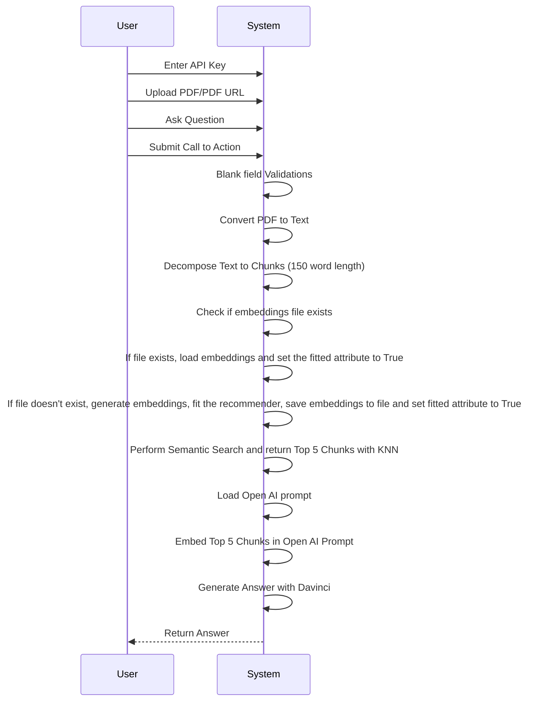
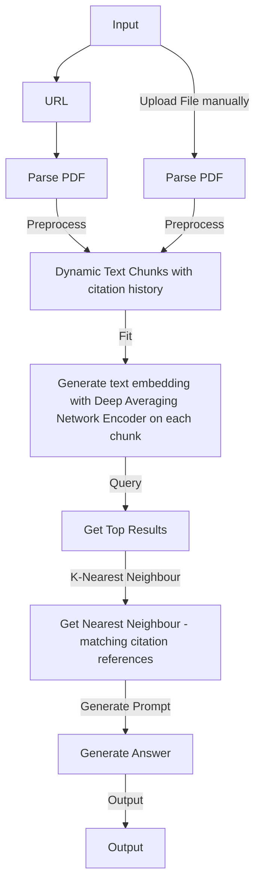

# pdfGPT
## Demo
1. **Demo URL**: https://bit.ly/41ZXBJM
========================================================================================================================
## IMPORTANT NOTICE: 
### **As of [June, 27, 2023], PDF-GPT has been deprecated and is no longer maintained or supported. For ongoing development, new features, or bug fixes, you are encouraged to fork this repository or work on a copy of the source code.**

__PDF-GPT has garnered a significant amount of interest and support, and we're grateful for all the feedback and contributions. However, due to the ever-evolving nature of the project and the demands of maintaining it, we have made the difficult decision to deprecate the library.__
__While we will no longer be providing updates or addressing issues, the codebase will remain available here on GitHub. You're welcome to use the code as a starting point for your own projects, or to modify it to suit your needs.__
Thank you for your understanding and your support for PDF-GPT. We're excited to see what the community will create with it in the future.

The original source code can be found at: https://huggingface.co/spaces/bhaskartripathi/pdfChatter

## -Bhaskar Tripathi
========================================================================================================================

**NOTE**: Please star this project if you like it!

### Problem Description : 
1. When you pass a large text to Open AI, it suffers from a 4K token limit. It cannot take an entire pdf file as an input
2. Open AI sometimes becomes overtly chatty and returns irrelevant response not directly related to your query. This is because Open AI uses poor embeddings.
3. ChatGPT cannot directly talk to external data. Some solutions use Langchain but it is token hungry if not implemented correctly.
4. There are a number of solutions like https://www.chatpdf.com, https://www.bespacific.com/chat-with-any-pdf, https://www.filechat.io they have poor content quality and are prone to hallucination problem. One good way to avoid hallucinations and improve truthfulness is to use improved embeddings. To solve this problem, I propose to improve embeddings with Universal Sentence Encoder family of algorithms (Read more here: https://tfhub.dev/google/collections/universal-sentence-encoder/1). 

### Solution: What is PDF GPT ?
1. PDF GPT allows you to chat with an uploaded PDF file using GPT functionalities.
2. The application intelligently breaks the document into smaller chunks and employs a powerful Deep Averaging Network Encoder to generate embeddings.
3. A semantic search is first performed on your pdf content and the most relevant embeddings are passed to the Open AI.
4. A custom logic generates precise responses. The returned response can even cite the page number in square brackets([]) where the information is located, adding credibility to the responses and helping to locate pertinent information quickly. The Responses are much better than the naive responses by Open AI.
5. Andrej Karpathy mentioned in this post that KNN algorithm is most appropriate for similar problems: https://twitter.com/karpathy/status/1647025230546886658
6. Enables APIs on Production using **[langchain-serve](https://github.com/jina-ai/langchain-serve)**.

### Docker
Run `docker-compose -f docker-compose.yaml up` to use it with Docker compose.


## Use `pdfGPT` on Production using [langchain-serve](https://github.com/jina-ai/langchain-serve)

#### Local playground
1. Run `lc-serve deploy local api` on one terminal to expose the app as API using langchain-serve.
2. Run `python app.py` on another terminal for a local gradio playground.
3. Open `http://localhost:7860` on your browser and interact with the app.


#### Cloud deployment

Make `pdfGPT` production ready by deploying it on [Jina Cloud](https://cloud.jina.ai/).

`lc-serve deploy jcloud api` 

<details>
<summary>Show command output</summary>

```text
╭──────────────┬──────────────────────────────────────────────────────────────────────────────────────╮
│ App ID       │                                 langchain-3ff4ab2c9d                                 │
├──────────────┼──────────────────────────────────────────────────────────────────────────────────────┤
│ Phase        │                                       Serving                                        │
├──────────────┼──────────────────────────────────────────────────────────────────────────────────────┤
│ Endpoint     │                      https://langchain-3ff4ab2c9d.wolf.jina.ai                       │
├──────────────┼──────────────────────────────────────────────────────────────────────────────────────┤
│ App logs     │                               dashboards.wolf.jina.ai                                │
├──────────────┼──────────────────────────────────────────────────────────────────────────────────────┤
│ Swagger UI   │                    https://langchain-3ff4ab2c9d.wolf.jina.ai/docs                    │
├──────────────┼──────────────────────────────────────────────────────────────────────────────────────┤
│ OpenAPI JSON │                https://langchain-3ff4ab2c9d.wolf.jina.ai/openapi.json                │
╰──────────────┴──────────────────────────────────────────────────────────────────────────────────────╯
```

</details>

#### Interact using cURL

(Change the URL to your own endpoint)

**PDF url**
```bash
curl -X 'POST' \
  'https://langchain-3ff4ab2c9d.wolf.jina.ai/ask_url' \
  -H 'accept: application/json' \
  -H 'Content-Type: application/json' \
  -d '{
  "url": "https://uiic.co.in/sites/default/files/uploads/downloadcenter/Arogya%20Sanjeevani%20Policy%20CIS_2.pdf",
  "question": "What'\''s the cap on room rent?",
  "envs": {
    "OPENAI_API_KEY": "'"${OPENAI_API_KEY}"'"
    }
}'

{"result":" Room rent is subject to a maximum of INR 5,000 per day as specified in the Arogya Sanjeevani Policy [Page no. 1].","error":"","stdout":""}
```

**PDF file**
```bash
QPARAMS=$(echo -n 'input_data='$(echo -n '{"question": "What'\''s the cap on room rent?", "envs": {"OPENAI_API_KEY": "'"${OPENAI_API_KEY}"'"}}' | jq -s -R -r @uri))
curl -X 'POST' \
  'https://langchain-3ff4ab2c9d.wolf.jina.ai/ask_file?'"${QPARAMS}" \
  -H 'accept: application/json' \
  -H 'Content-Type: multipart/form-data' \
  -F 'file=@Arogya_Sanjeevani_Policy_CIS_2.pdf;type=application/pdf'

{"result":" Room rent is subject to a maximum of INR 5,000 per day as specified in the Arogya Sanjeevani Policy [Page no. 1].","error":"","stdout":""}
```

## Running on localhost
### Credits : [Adithya S](https://github.com/200901002)
1. Pull the image by entering the following command in your terminal or command prompt:
```bash
docker pull registry.hf.space/bhaskartripathi-pdfchatter:latest
```
2. Download the Universal Sentence Encoder locally to your project's root folder. This is important because otherwise, 915 MB will be downloaded at runtime everytime you run it.
3. Download the encoder using this [link](https://tfhub.dev/google/universal-sentence-encoder/4?tf-hub-format=compressed).
4. Extract the downloaded file and place it in your project's root folder as shown below:
```text
Root folder of your project
└───Universal Sentence Encoder
|   ├───assets
|   └───variables
|   └───saved_model.pb
|
└───app.py
```
5. If you have downloaded it locally, replace the code on line 68 in the API file:
```python
self.use = hub.load('https://tfhub.dev/google/universal-sentence-encoder/4')
```
with:
```python
self.use = hub.load('./Universal Sentence Encoder/')
```
6. Now, To run PDF-GPT, enter the following command:

```bash
docker run -it -p 7860:7860 --platform=linux/amd64 registry.hf.space/bhaskartripathi-pdfchatter:latest python app.py
```
### **Original Source code** (for demo hosted in Hugging Face) : https://huggingface.co/spaces/bhaskartripathi/pdfChatter/blob/main/app.py


## UML


### Flowchart

## Star History

[](https://star-history.com/#bhaskatripathi/pdfGPT&Date)
I am looking for more contributors from the open source community who can take up backlog items voluntarily and maintain the application jointly with me.

## Also Try:
This app creates schematic architecture diagrams, UML, flowcharts, Gantt charts and many more. You simple need to mention the usecase in natural language and it will create the desired diagram.
https://github.com/bhaskatripathi/Text2Diagram

## License
This project is licensed under the MIT License. See the [LICENSE.txt](LICENSE.txt) file for details.

