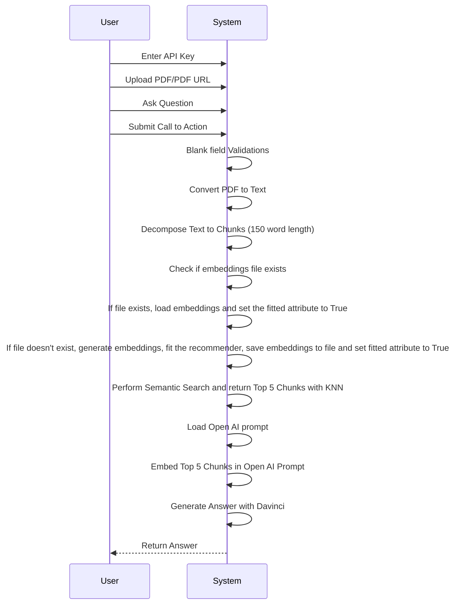
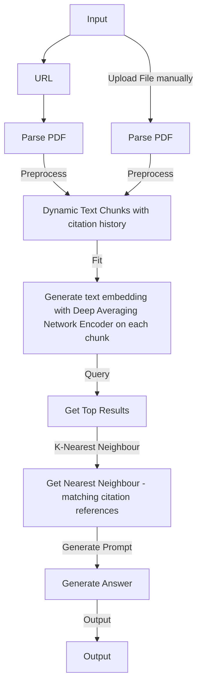

# pdfGPT
## Demo
1. **Demo URL**: https://huggingface.co/spaces/bhaskartripathi/pdfChatter
2. **Demo Video**:
   
   [](https://www.youtube.com/watch?v=LzPgmmqpBk8)
3. Despite so many fancy RAG solutions out there in Open Source and enterprise apps, pdfGPT is still the most accurate application that gives the most precise response. The first version was developed way back in 2021 as one of the world's earliest RAG open source solutions. To this day (Dec, 2024), it still remains one of the most accurate ones due to its very simple and unique architecture. It uses no third-party APIs such as langchain. It uses embeddings but no vectorDB, no indexing. But, it still doesn't compromise on the accuracy of response which is more critical than a fancy UI. The library documentation that you see below is a bit outdated as I do not get enough time to maintain it. However, if there is more demand then I am ready to put an enterprise grade RAG with more sophisticated retrieval tech available these days.
   
#### Version Updates (27 July, 2023):
1. Improved error handling
2. PDF GPT now supports Turbo models and GPT4 including 16K and 32K token model.
3. Pre-defined questions for auto-filling the input.
4. Implemented Chat History feature.


### Note on model performance
```If you find the response for a specific question in the PDF is not good using Turbo models, then you need to understand that Turbo models such as gpt-3.5-turbo are chat completion models and will not give a good response in some cases where the embedding similarity is low. Despite the claim by OpenAI, the turbo model is not the best model for Q&A. In those specific cases, either use the good old text-DaVinci-003 or use GPT4 and above. These models invariably give you the most relevant output.```

# Upcoming Release Pipeline:
1. Support for Falcon, Vicuna, Meta Llama
2. OCR Support
3. Multiple PDF file support
4. OCR Support
5. Node.Js based Web Application - With no trial, no API fees. 100% Open source.
    
### Problem Description : 
1. When you pass a large text to Open AI, it suffers from a 4K token limit. It cannot take an entire pdf file as an input
2. Open AI sometimes becomes overtly chatty and returns irrelevant response not directly related to your query. This is because Open AI uses poor embeddings.
3. ChatGPT cannot directly talk to external data. Some solutions use Langchain but it is token hungry if not implemented correctly.
4. There are a number of solutions like https://www.chatpdf.com, https://www.bespacific.com/chat-with-any-pdf, https://www.filechat.io they have poor content quality and are prone to hallucination problem. One good way to avoid hallucinations and improve truthfulness is to use improved embeddings. To solve this problem, I propose to improve embeddings with Universal Sentence Encoder family of algorithms (Read more here: https://tfhub.dev/google/collections/universal-sentence-encoder/1). 

### Solution: What is PDF GPT ?
1. PDF GPT allows you to chat with an uploaded PDF file using GPT functionalities.
2. The application intelligently breaks the document into smaller chunks and employs a powerful Deep Averaging Network Encoder to generate embeddings.
3. A semantic search is first performed on your pdf content and the most relevant embeddings are passed to the Open AI.
4. A custom logic generates precise responses. The returned response can even cite the page number in square brackets([]) where the information is located, adding credibility to the responses and helping to locate pertinent information quickly. The Responses are much better than the naive responses by Open AI.
5. Andrej Karpathy mentioned in this post that KNN algorithm is most appropriate for similar problems: https://twitter.com/karpathy/status/1647025230546886658
6. Enables APIs on Production using **[langchain-serve](https://github.com/jina-ai/langchain-serve)**.

### Docker
Run `docker-compose -f docker-compose.yaml up` to use it with Docker compose.


## UML


### Flowchart

## Star History

[](https://star-history.com/#bhaskatripathi/pdfGPT&Date)
I am looking for more contributors from the open source community who can take up backlog items voluntarily and maintain the application jointly with me.

## Also Try Knowledge Graph RAG Gita:
This project, graphGita, is the first modern re-interpretation of the Bhagavad Gita that utilizes Knowledge Graphs for accurate query retrieval and qunatify philosphical aspects to serve specific problem-solution needs. The ambitious goal is to incorporate over 200 versions of Gita interpretations written from time-to-time by different past and present scholars and integrate them in form of a sophisticated Knowledge Graph aided with modern retrieval technologies such as Monte Carlo Tree Search, and KG-RAG to provide a seamless multi-modal experience (text, image and video) to users. My primary goal is to increase readers' comprehension of philosophical ideas while offering pertinent perspectives for modern readers. Based on the literature reviews of each of the 18 chapters and how they relate to one another, the text is formatted into a graph structure. This structure may grow more sophisticated and complex with due course of time as the project progresses. 🚀 💥 
[https://github.com/bhaskatripathi/graphGita](https://github.com/bhaskatripathi/graphGita)

## License
This project is licensed under the MIT License. See the [LICENSE.txt](LICENSE.txt) file for details.

## Citation
If you use PDF-GPT in your research or wish to refer to the examples in this repo, please cite with:

```bibtex
@misc{pdfgpt2023,
  author = {Bhaskar Tripathi},
  title = {PDF-GPT},
  year = {2023},
  publisher = {GitHub},
  journal = {GitHub Repository},
  howpublished = {\url{https://github.com/bhaskatripathi/pdfGPT}}
}
