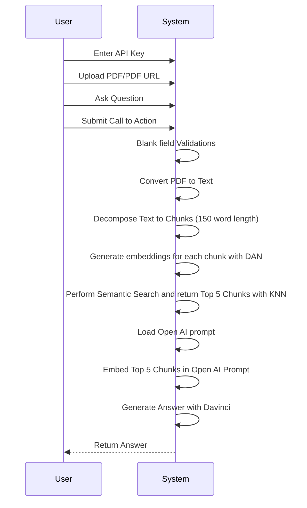
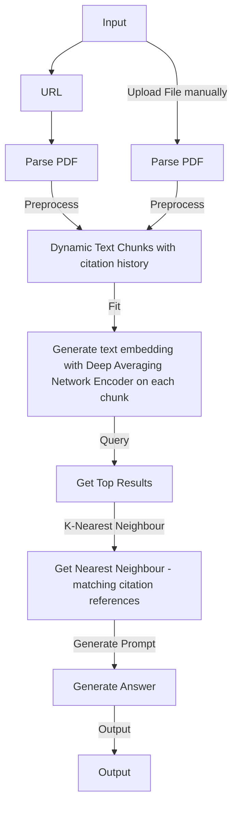

# pdfGPT
### Problem Description : 
1. When you pass a large text to Open AI, it suffers from a 4K token limit. It cannot take an entire pdf file as an input
2. Open AI sometimes becomes overtly chatty and returns irrelevant response not directly related to your query. This is because Open AI uses poor embeddings.
3. ChatGPT cannot directly talk to external data. 

### Solution: What is PDF GPT ?
1. PDF GPT allows you to chat with an uploaded PDF file using GPT functionalities.
2. The application intelligently breaks the document into smaller chunks and employs a powerful Deep Averaging Network Encoder to generate embeddings.
3. A semantic search is first performed on your pdf content and the most relevant embeddings are passed to the Open AI.
4. A custom logic generates precise responses. The returned response can even cite the page number in square brackets([]) where the information is located, adding credibility to the responses and helping to locate pertinent information quickly. The Responses are much better than the naive responses by Open AI.

### Demo
Demo URL: https://bhaskartripathi-pdfchatter.hf.space

**NOTE**: Please star this project if you like it!
### UML

### Flowchart

